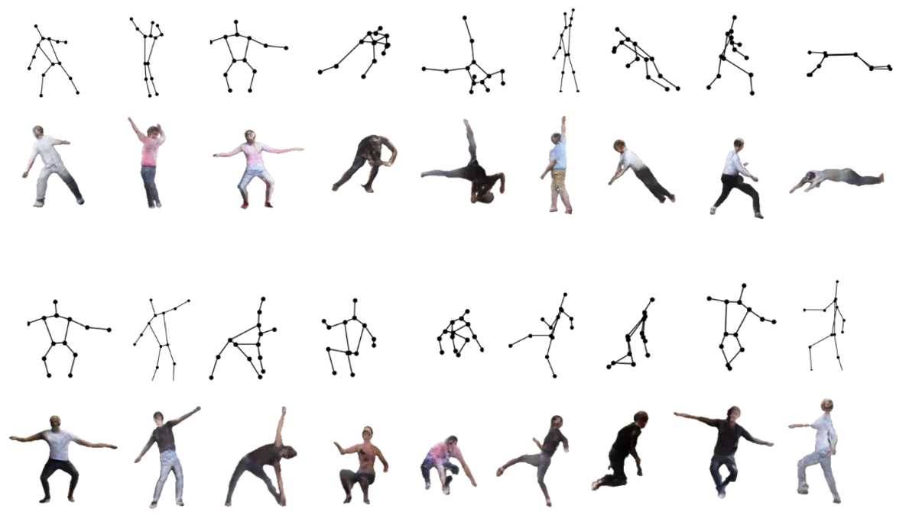

# synthetic_people

=================

## Overview 

This repository contains code for generating training data of synthetic people for developing 
objection detection networks.

## Abstract
Camera-based patient monitoring is undergoing rapid adoption in the healthcare sector with the recent COVID-
19 pandemic acting as a catalyst. It offers round-the-clock monitoring of patients in clinical units (e.g. ICUs,
ORs), or at their homes through installed cameras, enabling timely, pre-emptive care. These are powered by
Computer Vision based algorithms that pick up critical physiological data, patient activity, sleep pattern, etc.,
enabling real-time, pre-emptive care. In this work, we develop a person detector to deploy in such scenarios.
These algorithms require huge quantities of training data which is often in shortage in the healthcare field
due to stringent privacy norms. Therefore looking for solutions to enrich clinical data becomes necessary. An
alternative currently popular among the Computer Vision community is to use synthetic data for training,
created using 3D modeling software pipelines. However, this type of technique often has limitations in data
diversity and data balancing as desired variations need to be provided explicitly. In this thesis, we propose
a data augmentation method for enriching diversity in synthetic data without using any additional external
data or software. In particular, we introduce a pose augmentation technique, which synthesizes new human
characters in poses unseen in the original dataset using Pose-Warp GAN. Additionally, a new metric is proposed
to assess diversity in human pose datasets. The proposed method of augmentation is evaluated using YOLOv3.
We show that our pose augmentation technique significantly improves person detection performance compared
to traditional data augmentation, especially in low data regimes.

## Methodology
To reproduce the results of this work, follow the steps mentioned below. The image below is provided for reference.
